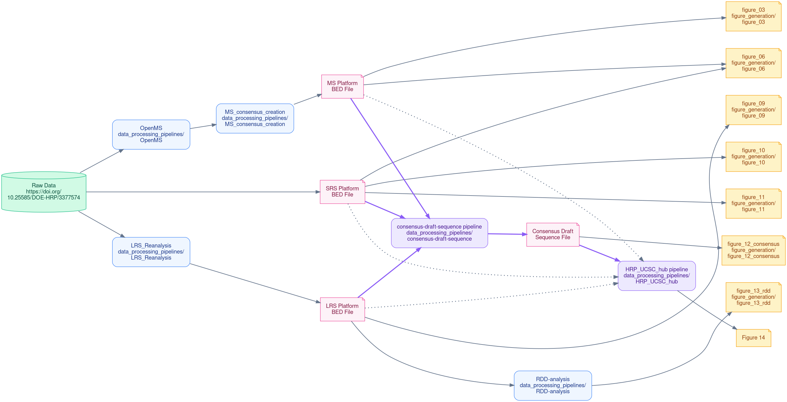

# Human RNome Project

Reference sequences of full-length RNA transcripts and their chemical modifications, built through open international collaboration.

[HumanRNomeProject.org](https://humanrnomeproject.org)

---

## About

The Human RNome Project is an international scientific consortium dedicated to building reference sequences of full-length RNA transcripts and their chemical modifications. By integrating complementary measurements from short-read sequencing, long-read direct RNA sequencing, and mass spectrometry, the consortium is creating reference Human RNome sequences that will serve as foundational resources for RNA biology, biotechnology, and precision medicine.

## Mission

The Human RNome Project develops community standards, reference datasets, analytical methods, and open resources that enable accurate, reproducible, and interoperable characterization of RNA chemical modifications. Through international collaboration, the project aims to accelerate the discovery of RNA biology and its translation to human health, agriculture, and biomanufacturing.

## HRP-benchmarking-project Repository

This repository contains the analysis workflows, software, documentation, and benchmark datasets developed by the Human RNome Project consortium. These resources support reproducible analysis of RNA modifications across complementary technologies, including:

* Short-read sequencing
* Direct long-read RNA sequencing
* Mass spectrometry

The repository provides standardized pipelines from raw data through processed benchmark datasets and enables transparent comparisons of RNA modification measurements across laboratories and technologies.

### Data Journey

This guide explains how we take raw data from our experiments and turn it into the final figures and results you see in the paper. It also explains the `HRP-benchmarking-project` repository structure.  

**The Big Picture:** Our project uses three different technologies to study RNA. Each technology has its own automated pipeline to clean and analyze the data. Once the data is analyzed, we do two things:
1. **Build the Consensus:** We combine the processed data from all three technologies to create one master map of the RNA.
2. **Create Specific Figures:** We use the processed data from each technology (and the consensus) to make specific charts and graphs.

Here is a simplified flowchart of the process:

#### Phase 1: Analyzing the Raw Data (Platform Pipelines)
The code for these pipelines resides in `data_processing_pipelines/`.

* **Long-Read Sequencing (LRS):** 
  * [`data_processing_pipelines/LRS_Reanalysis/`](data_processing_pipelines/LRS_Reanalysis/): Contains WDL Pipelines (polyA, rRNA, tRNA) that generate per-base modkit calls. Also contains the Format Conversion & Merging Python helper scripts converting modkit outputs into standardized `bedrmod` files.
  * [`data_processing_pipelines/RDD-analysis/`](data_processing_pipelines/RDD-analysis/): Long-Read Native Error Rate Computation Pipeline. Computes genomic mismatch rates and RDD sites from BAMs. Outputs feed directly into all error rate panels (Fig 13).

* **Short-Read Sequencing (SRS):** 
  * The raw data is processed through short-read sequencing analysis pipelines to generate SRS platform-specific BED files. (Note: The original raw pipelines have been archived; only the final generated BED files are used downstream).

* **Mass Spectrometry (MS):** 
  * [`data_processing_pipelines/OpenMS/`](data_processing_pipelines/OpenMS/): Raw C++ source code fork of the OpenMS framework utilized by the mass spectrometry pipelines to produce quantitative calibration curves and absolute abundances.
  * [`data_processing_pipelines/MS_consensus_creation/`](data_processing_pipelines/MS_consensus_creation/): Mass Spectrometry Consensus Creation Pipeline. Scripts responsible for generating the MS-only preliminary consensus calls (the platform-specific BED file) before final multi-technology integration.

#### Phase 2: The Consensus (Combining the Data)
We merge the results from all three methods to create a "Consensus" reference sequence, a combined map of the RNA.

* **Consensus Draft:** 
  * [`data_processing_pipelines/consensus-draft-sequence/`](data_processing_pipelines/consensus-draft-sequence/): Multi-Technology Consensus Sequence Generation Pipeline. Merges harmonized MS, SRS, and LRS `.bedrmod` files into a unified dataset. Outputs directly feed the Consensus Comparison Panels (Fig 12).
* **UCSC Genome Browser:** 
  * [`data_processing_pipelines/HRP_UCSC_hub/`](data_processing_pipelines/HRP_UCSC_hub/): UCSC Genome Browser Track Processing Scripts. Formats `bedrmod` files into custom decorators and configurations. Outputs are used for live UCSC Browser rendering (which produces Figure 14).

#### Phase 3: Creating the Figures
Once the data is analyzed and the consensus is built, we use short scripts to draw the actual figures for the paper. All of these drawing scripts are neatly organized by figure number in the `figure_generation/` folder.

* **[`figure_generation/figure_03/`](figure_generation/figure_03/) (Figure 3: Mass Spectrometry Absolute Quantification Plots):** `figure3a-f.py` generates panels A-F (absolute quantification plots). `figure_3g.py` generates panel G.
* **[`figure_generation/figure_06/`](figure_generation/figure_06/) (Figure 6: Mass Spectrometry rRNA Modification Maps):** `figure_6a.py` plots the 18S rRNA MS map. `figure_6b.py` plots the 28S map. `figure_6c.py` plots the tRNA MS heatmap.
* **[`figure_generation/figure_09/`](figure_generation/figure_09/) (Figure 9: Long-Read Sequence Motifs and Metagene Distributions):** `Motif_Fig_9B.py` generates sequence motif logos. `MetagenePlot_Fig9_C.R` generates metagene distribution plots.
* **[`figure_generation/figure_10/`](figure_generation/figure_10/) (Figure 10: Short-Read Sequencing rRNA Modification Maps):** `figure10b.py` and `figure10c.py` generate the rRNA and tRNA Illumina maps. Includes 1D lollipop helper modules (`plot_18.py`, etc.).
* **[`figure_generation/figure_11/`](figure_generation/figure_11/) (Figure 11: Short-Read Sequencing Integrated Metagene Plots):** Contains R scripts (e.g., `3.0_integrated_metagene.R`) that generate integrated metagene density plots for the modification data.
* **[`figure_generation/figure_12_consensus/`](figure_generation/figure_12_consensus/) (Figure 12: Multi-Technology Consensus Panels):** Generates panels for Figure 12 detailing the Consensus Draft. Includes scripts plotting genome-wide Manhattan density of modifications, zoomed chromosomal regions, metagene distributions, and Peptidyl Transferase Center (PTC) mapping. Also includes `figure12i.py` which renders the structural modification map for consensus tRNAs using standard Sprinzl coordinates.
* **[`figure_generation/figure_13_rdd/`](figure_generation/figure_13_rdd/) (Figure 13: Sequencing Error Rates and RDDs):** Generates panels for Figure 13 detailing error rate benchmarking. Includes scripts plotting per-read error distributions, coverage vs mismatch rate, substitution error profiles, per-site error metrics, and RNA-DNA Differences (RDD) thresholds.

---

## Data and Benchmark Datasets

The raw data and benchmark datasets associated with this repository are available at DOE Data Explorer [https://doi.org/10.25585/DOE-HRP/3377574](https://doi.org/10.25585/DOE-HRP/3377574).

## Citation

*Coming soon.*

## Contributing

We welcome contributions from the community. Please open an issue to discuss proposed changes, report problems, or suggest improvements. For consortium participation and collaboration inquiries, please contact team leaders.

## Contact and More Information

For more information about the consortium, ongoing projects, publications, and community participation, visit [humanrnomeproject.org](https://humanrnomeproject.org).
