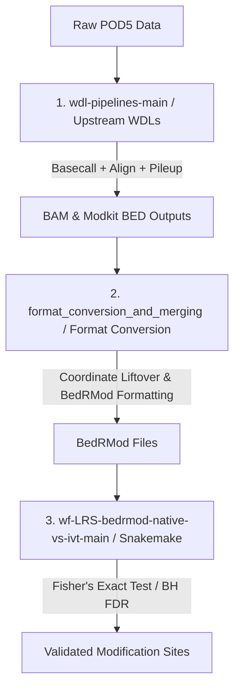

# Long-Read Sequencing (LRS) Modification Processing & Analysis Pipeline

This directory contains the pipeline modules used to process Long read sequencing (LRS) data and identify post-transcriptional RNA modifications across various RNA biotypes (polyA/mRNA, rRNA, tRNA).

The pipeline is organized into three distinct layers, reflecting the progression of data from raw signal inputs to statistically validated modification sites.

---

## Overall Pipeline Architecture

The workflow progresses through the folders in this directory as follows:

---

## Directory Overview

The folder is divided into three main components:

### 1. [`wdl-pipelines-main/`](wdl-pipelines-main/) (Upstream Processing Layer)
- **Purpose:** Basecalling, alignment, and initial modification calling from raw sequencer outputs.
- **Key Features:**
  - Standardized WDL workflows optimized for NERSC Perlmutter (using the JAWS executor) or local execution (Cromwell/miniwdl).
  - Divided by RNA biotype:
    - **[`polyA_pipeline/`](wdl-pipelines-main/LRS/polyA_pipeline/)**: Dorado basecalling, Minimap2 alignment, NanoComp QC, and Modkit modification pileups for polyadenylated mRNAs.
    - **[`rRNA_pipeline/`](wdl-pipelines-main/LRS/rRNA_pipeline/)**: Specialized alignment against custom rRNA references and Modkit pileups.
    - **[`tRNA_pipeline/`](wdl-pipelines-main/LRS/tRNA_pipeline/)**: Relies on a multi-stage workflow including Dorado basecalling, transcriptome realignment with 3' CCA tail references, and Modkit pileup.

### 2. [`format_conversion_and_merging/`](format_conversion_and_merging/) (Intermediate Formatting Layer)
- **Purpose:** Post-processing, remapping, coordinate liftovers, and standardization of raw Modkit outputs into `bedRMod` format.
- **Key Features:**
  - **[`liftover_to_BedRMod.py`](format_conversion_and_merging/liftover_to_BedRMod.py)**: Standardizes chromosome and modification names, applies ONT tRNA coordinate adapter offsets, and merges outputs across different RNA biotypes and technologies into a single unified `bedRMod` file (see details in [liftover_to_BedRMod.README.md](format_conversion_and_merging/liftover_to_BedRMod.README.md)).
  - **[`merge_stepwise_modkit_files_and_add_weighted_sum.py`](format_conversion_and_merging/merge_stepwise_modkit_files_and_add_weighted_sum.py)**: Aggregates Modkit runs performed across a grid of confidence thresholds (0.85 to 0.99), tracks the maximum threshold where each modification site is called, and computes composite weighted-sum scores (see details in [merge_stepwise_modkit_files_and_add_weighted_sum.README.md](format_conversion_and_merging/merge_stepwise_modkit_files_and_add_weighted_sum.README.md)).

### 3. [`wf-LRS-bedrmod-native-vs-ivt-main/`](wf-LRS-bedrmod-native-vs-ivt-main/) (Downstream Analysis Layer)
- **Purpose:** Comparative analysis of native sequencing datasets against unmodified in-vitro transcribed (IVT) control samples to identify and validate true modification sites.
- **Key Features:**
  - Snakemake workflow execution (see details in [README.md](wf-LRS-bedrmod-native-vs-ivt-main/README.md)).
  - Implements statistical tests (Fisher's exact test) comparing native vs. IVT base modification frequencies at positions with $\ge 30\times$ coverage.
  - Applies Benjamini–Hochberg False Discovery Rate (FDR) corrections for multiple testing to control false positives.

---

## Getting Started

1. **Upstream Processing:** Follow the instructions in the [`wdl-pipelines-main/README.md`](wdl-pipelines-main/README.md) to basecall and map your raw reads.
2. **Format Conversion:** Run the Python scripts described in the [`format_conversion_and_merging/`](format_conversion_and_merging/) folder to standardize your files.
3. **Downstream Selection:** Use the Snakemake environment in [`wf-LRS-bedrmod-native-vs-ivt-main/`](wf-LRS-bedrmod-native-vs-ivt-main/) to perform final statistical filtering.
