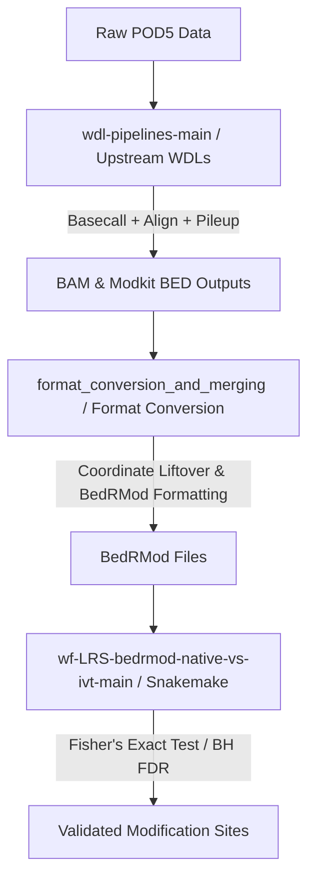

# Long-Read Sequencing (LRS) WDL Processing Pipelines

This directory contains the primary WDL workflows used to process Oxford Nanopore Technologies (ONT) direct RNA sequencing (dRNA-seq) datasets. The pipelines are optimized for execution on high-performance computing (HPC) environments using **JAWS** (Joint Analysis Workflow Service) on NERSC Perlmutter, but can also run locally or on other WDL-compatible execution engines (e.g., Cromwell or miniwdl).

## Directory Structure

Under the main `LRS/` subfolder, the workflows are structured by RNA biotype/pipeline target:

```
wdl-pipelines-main/
├── README.md                  # This file (overview)
└── LRS/                       # LRS pipeline workflows
    ├── polyA_pipeline/        # Processing workflows for polyA/mRNA sequencing data
    ├── rRNA_pipeline/         # Processing workflows for ribosomal RNA (rRNA) sequencing data
    └── tRNA_pipeline/         # Processing workflows for transfer RNA (tRNA) sequencing data
```

---

## Overview of Pipelines

Each subfolder contains specific WDL workflows designed for the unique alignment and sequence analysis characteristics of each RNA biotype:

### 1. [polyA_pipeline](LRS/polyA_pipeline/)
- **Target:** Direct RNA sequencing datasets targeting polyadenylated mRNAs.
- **Workflow Highlights:**
  - `pipeline_SCATTER_jaws.wdl`: A full end-to-end pipeline executing demultiplexing (`Seqtagger`), high-accuracy basecalling with modification output (`Dorado`), quality control reporting (`NanoComp`), genome/transcriptome alignment (`Minimap2`), and modification frequency estimation (`Modkit`).
  - `pipeline_polyA_bam_merge_modkit_SCATTER.wdl`: Merges multiple BAM outputs and generates `Modkit` pileups across a grid of custom modification probability thresholds.

### 2. [rRNA_pipeline](LRS/rRNA_pipeline/)
- **Target:** Direct RNA sequencing datasets targeting cytosolic and mitochondrial ribosomal RNAs.
- **Workflow Highlights:**
  - `pipeline_SCATTER_jaws_rRNA.wdl`: Performs end-to-end basecalling and alignment against a custom human rRNA reference sequence database.
  - `pipeline_rRNA_bam_merge_modkit_SCATTER.wdl`: Aggregates the rRNA basecalled alignments and runs `Modkit` pileups across a grid of modification probability thresholds.

### 3. [tRNA_pipeline](LRS/tRNA_pipeline/)
- **Target:** Direct RNA sequencing datasets targeting mature transfer RNAs (tRNAs).
- **Workflow Highlights:**
  - `pipeline_SCATTER_jaws_tRNA_KJ.wdl`: Performs scattered basecalling on raw POD5 inputs, outputs a demultiplexing table, and merges files to produce sample-level unaligned BAMs.
  - `tRNA_realign_JM.wdl`: Re-aligns unaligned tRNA reads to a specialized tRNA transcriptome reference containing 3' CCA tails using custom alignment settings optimized for short, heavily-modified tRNA reads, and runs `Modkit`.
  - `pipeline_tRNA_bam_merge_modkit_SCATTER.wdl`: Merges sample tRNA alignments and generates `Modkit` pileups across multiple probability thresholds.

---

## Role in the Overall LRS Analysis Pipeline

The workflows in this directory represent the **upstream processing layer** of the Long-Read Sequencing reanalysis pipeline:



1. **Upstream (Here):** The WDL pipelines in this folder consume raw `POD5` signal data and output basecalled reads, genome/transcriptome alignments, and thresholded `Modkit` pileups.
2. **Intermediate (Format Conversion):** The scripts in `format_conversion_and_merging/` take the resulting `Modkit` output files, perform reference lift-overs (translating transcriptomic coordinates back to genomic coordinates where appropriate), and convert them to the standardized `BedRMod` format.
3. **Downstream (Analysis):** The Snakemake pipeline in `wf-LRS-bedrmod-native-vs-ivt-main/` processes the native and IVT `BedRMod` files, performing statistical comparisons (Fisher's exact test with FDR correction) to filter out basecalling errors and confidently identify authentic modification sites.
