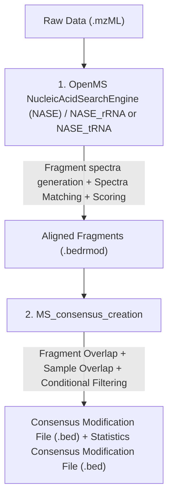

# MS-seq Analysis

This directory contains the pipeline modules used to process MS-seq data and identify post-transcriptional RNA modifications across the RNA biotypes rRNA and tRNA.

The pipeline is organized into two distinct layers, the Open-MS spectra to a sequence mapping and the Consensus creation pipeline, combining aligned fragments and different samples to a consensus modification map.

---

## Overall Pipeline Architecture

The workflow progresses through the folders in this directory as follows:



---


## Directory Overview

The folder is divided into four main components:

### 1. [`NASE_rRNA/`](NASE_rRNA/) (rRNA-pipeline)
- **Purpose:** rRNA specific generation of digested fragments and their spectra, matching of these spectra with the sample, scoring of the results 
- **Key Features:**
    - Pipeline execution script (see details in [README.md](NASE_rRNA/README.md)).
    - Pipeline Specifications for generation of decoy database and general workflow

### 1. [`NASE_tRNA/`](NASE_tRNA/) (tRNA-pipeline)
- **Purpose:** tRNA specific generation of digested fragments and their spectra, matching of these spectra with the sample, scoring of the results 
- **Key Features:**
    - Pipeline execution script (see details in [README.md](NASE_rRNA/README.md)).
    - Pipeline Specifications for generation of decoy database and general workflow


### 3. [`MS-seq Consensus creation/`](MS_consensus_creation/) (Sample Merging/Filtering pipeline)
- **Purpose:** Filtering and merging of different aligned fragment files to a consensus modification map.
- **Key Features:**
  - Consensus_creation_main python script. Initiates the pipeline (see details in [README.md](MS_consensus_creation/README.md)).

### 4. [`OpenMS/`](OpenMS/) (Main MS software bundle)
- **Purpose:** Links to the OpenMS github page. Further Details for developers and scientists to adapt our pipeline and use additional tools.

---

## Getting Started

1. **rRNA/tRNA Processing:** Follow the instructions in the [`NASE_rRNA/README.md`](NASE_rRNA/README.md) or [`NASE_tRNA/README.md`](NASE_tRNA/README.md) to get the aligned modified fragments.
2. **Filtering and Consensus Modifications** Follow the instructions in the [`MS_consensus_creation/README.md`](MS_consensus_creation/README.md) to extract your modifications.

---

## Docker image

A [`Dockerfile`](Dockerfile) is provided that bundles the OpenMS executables (`ghcr.io/openms/openms-executables:RNOME`) with a Python environment and all three pipeline scripts, so a single container can process one input file/sample at a time (e.g. as an HPC array-job task).

**Build:**
```bash
docker build -t hrp-ms-seq:latest .
```

**Run** (mount your data folder and pick a mode: `rrna`, `trna`, or `consensus`):
```bash
docker run --rm -v "$PWD":/data hrp-ms-seq:latest rrna \
    /data/sample.mzML /data/ref.fasta \
    --precursor-tolerance 10 --product-tolerance 20 --output-dir /data/results

docker run --rm -v "$PWD":/data hrp-ms-seq:latest trna \
    /data/sample.mzML /data/ref.fasta \
    --precursor-tolerance 10 --product-tolerance 20 --output-dir /data/results

docker run --rm -v "$PWD":/data hrp-ms-seq:latest consensus \
    --input-folder /data/samples --out-file /data/consensus.bed
```

Run `docker run --rm hrp-ms-seq:latest --help` for the full usage message, or pass `bash` as the mode for an interactive shell.

