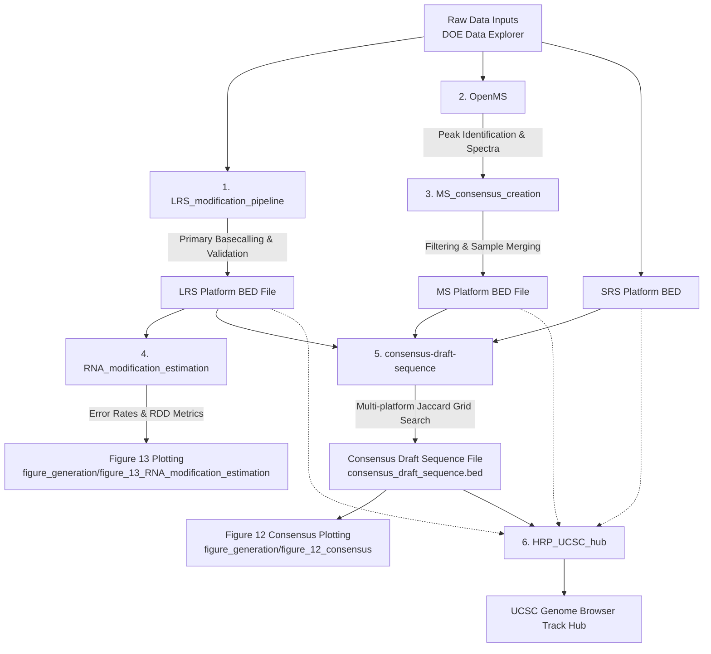

# Human RNome Project — Data Processing Pipelines

This directory contains the computational data processing pipelines used by the **Human RNome Project (HRP)** to process raw sequencing and mass spectrometry datasets, perform quality control and statistical validation, build consensus modification references, and prepare genome browser visualization hubs.

---

## Overall Pipeline Architecture

The overall data flow from raw data inputs (`DOE Data Explorer doi:10.25585/DOE-HRP/3377574`) through the processing pipelines in this folder to final figure generation is illustrated below (corresponding to `HRP-benchmarking-project/flowchart.png`):

---

## Directory Overview

The processing workflows in this directory are structured into six specialized pipeline components:

### 1. [`LRS_modification_pipeline/`](LRS_modification_pipeline/) (Primary Long-Read Processing)
- **Purpose:** Processes raw Oxford Nanopore Direct RNA Sequencing (DRS) POD5 files into statistically validated RNA modification calls across polyA RNA, rRNA, and tRNA biotypes.
- **Key Modules:**
  - **`wdl-pipelines-main/`:** Upstream WDL workflows for Dorado basecalling, Minimap2 alignment, NanoComp QC, and Modkit modification pileup.
  - **`format_conversion_and_merging/`:** Standardizes raw Modkit outputs into `bedRMod` format, applies coordinate adapter offsets, and handles transcriptome liftovers.
  - **`wf-LRS-bedrmod-native-vs-ivt-main/`:** Snakemake workflow performing Fisher's exact tests comparing native vs. in-vitro transcribed (IVT) control samples with Benjamini-Hochberg FDR correction.
- **Flowchart Integration:** Input: `Raw POD5 Data` → Output: `LRS Platform BED File` (feeds into `consensus-draft-sequence`, `RNA_modification_estimation`, `HRP_UCSC_hub`, and Figures 8 & 9).

---

### 2. [`OpenMS/`](OpenMS/) (Primary Mass Spectrometry Search Engine)
- **Purpose:** Open-source C++ framework and toolset for processing liquid chromatography-mass spectrometry (LC-MS/MS) nucleoside and oligonucleotide datasets.
- **Key Features:**
  - Performs peak identification, retention time alignment, isotope pattern analysis, and mass-to-charge ($m/z$) spectral matching.
  - Generates raw mass spectrometry fragment lists and modification call tables.
- **Flowchart Integration:** Input: `Raw Mass Spectrometry Data` → Output: Sample-level MS fragment tables (feeds directly into `MS_consensus_creation`).

---

### 3. [`MS_consensus_creation/`](MS_consensus_creation/) (Secondary Mass Spectrometry Harmonization)
- **Purpose:** Merges, filters, and standardizes sample-level MassSpectrometry (OpenMS) bedrmod files into a single unified MS platform reference.
- **Key Modules:**
  - **`consensus_creation_main.py`:** Command-line tool that applies score/q-value filtering (`--q-score`), frequency thresholds (`--freq`), sample overlap filtering (`--min-samples`, `--min-overlap`), and optional tRNA base-end trimming (`--tRNA`).
- **Flowchart Integration:** Input: Sample OpenMS BEDs → Output: `MS Platform BED File` (feeds into `consensus-draft-sequence`, `HRP_UCSC_hub`, and Figures 3 & 6).

---

### 4. [`RNA_modification_estimation/`](RNA_modification_estimation/) (Secondary Error Rate & RDD Analysis)
- **Purpose:** Analyzes sequencing error profiles, substitution spectra, and candidate RNA-DNA Differences (RDDs) from long-read alignments.
- **Key Modules:**
  - Upstream per-chromosome `pysamstats --type variation` count table generation (`samtools view -F 2304`).
  - **`scripts/generation/`:** Upstream calculation scripts for per-read total error rates (`calculate_read_error_rates_parallel.py`), coverage-binned mismatch rates (`calculate_coverage_error_rate.py`), modkit stratified mismatch rates (`calculate_native_mismatch_rates_memeff_fast.py`), and genome-wide RDD JSON summaries (`rdd_genomewide.py`).
- **Flowchart Integration:** Input: `LRS Platform BED` & aligned BAMs → Output: Precalculated error & RDD summary tables (feeds directly into **Figure 13** plotting in `figure_generation/figure_13_RNA_modification_estimation/`).

---

### 5. [`consensus-draft-sequence/`](consensus-draft-sequence/) (Global Consensus Draft Reference Integration)
- **Purpose:** Integrates orthogonal modification calls across Short-Read Sequencing (SRS), Long-Read Sequencing (LRS), and Mass Spectrometry (MS) platforms to build the Human RNome Project benchmark consensus draft reference.
- **Key Modules:**
  - **`harmonize_massspec.py`:** Resolves ambiguous MassSpec modification calls (`mxA/mxC/mxG/mxU`) against curated reference BEDs and high-confidence sequencing datasets.
  - **Grid Search & Optimization:** Quantile parameter range generation (`generate_parameter_ranges.py`) and multi-way grid search optimization (`run_rrna_grid_from_ranges.py`, `run_3way_*.py`, `run_trna_grid_from_ranges.py`) to maximize Jaccard similarity across platforms.
  - **Classification & Tiering:** Filtering (`run_filtering.py`) and creation of tiered modification lists (`create_tiered_mod_lists.py`) and the unified `consensus_draft_sequence.bed`.
- **Flowchart Integration:** Inputs: `LRS Platform BED`, `SRS Platform BED`, `MS Platform BED` → Output: `Consensus Draft Sequence File` (`consensus_draft_sequence.bed`) (feeds into **Figure 12** plotting in `figure_generation/figure_12_consensus/` and `HRP_UCSC_hub`).

---

### 6. [`HRP_UCSC_hub/`](HRP_UCSC_hub/) (Genome Browser Track Hub Generation)
- **Purpose:** Converts modification call datasets into bigBed tracks and track hub configurations for interactive visualization on the UCSC Genome Browser.
- **Key Modules:**
  - **`scripts/pipeline.py`:** Main orchestration script splitting BED files by RNA biotype, building bigBed files, and generating track hub configurations.
  - **`scripts/make_decorator.py`:** Generates modification decorator tracks overlaid on underlying RNA sequence tracks.
  - **`scripts/BedPyLift.py`:** Utility for transcriptome-to-genome coordinate liftovers.
- **Flowchart Integration:** Inputs: `LRS Platform BED`, `SRS Platform BED`, `MS Platform BED`, `Consensus Draft Sequence File` → Output: Ready-to-load UCSC Track Hub (`ucsc_hub/`) for web browsing and Figure 14.

---

## Mapping Pipelines to Figure Generation

| Data Processing Directory | Key Output File(s) | Primary Downstream Figure Target |
|---|---|---|
| **`LRS_modification_pipeline/`** | `LRS Platform BED File` | `figure_generation/figure_08`, `figure_09` |
| **`OpenMS/` & `MS_consensus_creation/`** | `MS Platform BED File` | `figure_generation/figure_03`, `figure_06` |
| **`RNA_modification_estimation/`** | Count tables & RDD summaries | `figure_generation/figure_13_RNA_modification_estimation/` |
| **`consensus-draft-sequence/`** | `consensus_draft_sequence.bed`, `tiered_*.tsv` | `figure_generation/figure_12_consensus/` |
| **`HRP_UCSC_hub/`** | UCSC Track Hub (`ucsc_hub/`) | Genome Browser / Figure 14 |
