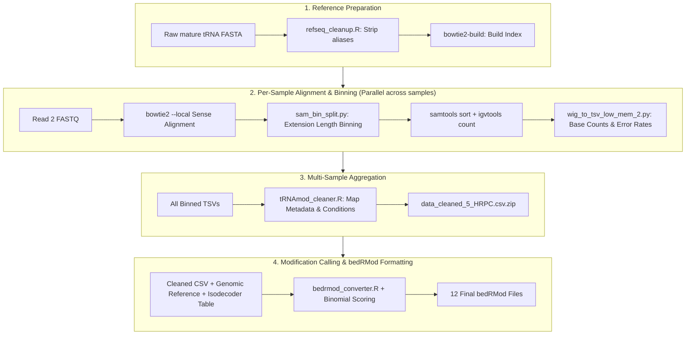

# Multiplex Small RNA Sequencing (MSR-seq) Data Processing Tutorial

Welcome to the Human RNome Project! This tutorial is designed as a friendly, step-by-step guide for anyone—from an undergraduate student with no prior bioinformatics experience to a Principal Investigator—to process Short-Read Sequencing (SRS) MSR-seq data.

In this tutorial, we will cover what MSR-seq is, how the chemistry and biology work, how to download the data, set up the Docker container, configure the pipeline, and run the automated WDL workflow locally or on a high-performance computing (HPC) cluster like NERSC Perlmutter.

---

## What is MSR-seq and Why Do We Need It?

Transfer RNAs (tRNAs) are essential molecular adaptors that translate mRNA codons into proteins. They are also the most densely chemically modified molecules in human cells, carrying dozens of distinct chemical marks (such as methylations, pseudouridines, and acetylations) that are vital for tRNA stability and accurate translation.

However, sequencing tRNAs is notoriously challenging:
1. **Tight Secondary Structure**: tRNAs fold into tight "cloverleaf" and L-shaped tertiary structures that block standard enzymes.
2. **Bulky Chemical Modifications**: Modifications at the Watson-Crick base-pairing face block reverse transcriptase (RT), causing premature termination or introducing characteristic mutation/deletion errors.

**MSR-seq (Multiplex Small RNA Sequencing)** solves these challenges:
- It uses a specialized capture hairpin oligonucleotide containing an RT primer ligated to the 3' CCA end of mature tRNAs.
- It employs **SuperScript IV (SSIV)** reverse transcriptase under optimized conditions to read through modified bases.
- It combines untreated control samples with specific chemical treatments:
  - **Untreated Control (`HRPC_ctrl`)**: Captures intrinsic RT termination and misincorporation signatures caused by bulky modifications (such as $m^1A$, $m^1G$, $m^2_2G$, $m^3C$, $m^2G$, $s^2U$, Inosine, and $acp^3U$).
  - **Bisulfite Treatment (`HRPC_BS`)**: Converts pseudouridine ($\Psi$), 7-methylguanosine ($m^7G$), and 2'-O-methylguanosine ($Gm$) into chemical adducts that form abasic sites, producing diagnostic **deletion signatures** during reverse transcription.
  - **Cyanoborohydride Treatment (`HRPC_CBH`)**: Selectively reduces $N^4$-acetylcytidine ($ac^4C$) and 5-formylcytidine ($f^5C$) under acidic conditions, producing diagnostic **mutation signatures** during reverse transcription.
- Reads are sequenced on Illumina platforms (e.g., NovaSeq X). Read 2 carries the reverse complement of the tRNA sequence.

```
       5' tRNA Terminus                                    3' CCA Tail
              |                                                 |
tRNA:         [=================================================CCA]
                                                                  ||| (Ligated Hairpin Adapter)
RT cDNA:      <---------------------------------------------------' (Primed by SSIV RT)
                 ^ Full-length extension reaches >= 60 nt (Bin 60_200)
```

---

## Step 1: Downloading the Raw Sequencing Data

In this step, we will download the raw sequencing files generated by the Illumina sequencer. Before we can identify modifications, we need the raw sequencing reads (stored as compressed FASTQ files, typically ending in `_2.txt.gz` or `.fastq.gz`) to align against human tRNA reference sequences.

1. Open your web browser and navigate to the project's data portal:  
   [https://doi.org/10.25585/DOE-HRP/3377574](https://doi.org/10.25585/DOE-HRP/3377574)
2. Follow the portal instructions to navigate to the **SRS (Short-Read Sequencing) MSR-seq** dataset.
   - The biological details, barcode IDs, and treatments for these samples are documented in [`HRP_MetaData_B_SRS.tsv`](file:///home/phoenix/projects/HRP_benchmarking_project/HRP-benchmarking-project/HRP_MetaData_B_SRS.tsv) under experiment ID **`HRP_B_012`** (samples `HRP_B_012_tRNA_001` through `HRP_B_012_tRNA_009`).
3. Save the demultiplexed FASTQ files into a dedicated raw data directory on your computer or cluster (for example, `/path/to/raw_msrseq/`).

> [!TIP]
> Each biological condition has 3 replicates, multiplexed using specific barcodes:
> - `bc8` (replicate 1)
> - `bc9` (replicate 2)
> - `bc10` (replicate 3)
>
> You only need the **Read 2** files (e.g., `L1_bc8_GGTA_2.txt.gz`) for tRNA modification analysis, as Read 2 directly sequences the tRNA molecule.

---

## Step 2: Getting the Code (Cloning the Repository)

Next, you will download the complete project codebase to your machine. This repository contains the automated pipelines, container configurations, and reference tables required to process the data.

Open your terminal (Terminal on Mac/Linux, or PowerShell/WSL on Windows) and run:

```bash
git clone https://github.com/Human-RNome-Project/HRP-benchmarking-project.git
```

**Understanding the command:**
- `git clone` copies the remote repository from GitHub directly onto your computer into a new directory called `HRP-benchmarking-project`.

---

## Step 3: Navigating to the MSR-seq Pipeline

Now, move your terminal into the folder where the MSR-seq pipeline lives:

```bash
cd HRP-benchmarking-project
cd pipelines/SRS_workflows/msrseq_wdl
```

**Understanding the command:**
- `cd` stands for "change directory". It moves your terminal session into the specified folder so you can run the scripts and workflows located there.

Let's look at what is inside this directory:
- `msrseq_pipeline.wdl`: The master workflow blueprint written in WDL (Workflow Description Language).
- `docker/`: Contains the `Dockerfile` recipe and all standalone scripts.
- `inputs_msrseq_local.json`: A ready-to-run configuration template for local testing.
- `inputs_msrseq_perlmutter.json`: A template configured with NERSC Perlmutter CFS paths.
- `README.md`: Quick reference guide for the pipeline.

---

## Step 4: Setting Up the Docker Container

Bioinformatics pipelines often require many different software tools (such as alignment tools, Python packages, and R libraries). Installing each tool manually on your computer can be frustrating due to operating system differences and version conflicts.

To solve this, we package the entire software environment into a **Docker container**. Think of a container as a lightweight, pre-configured "software box" that contains the exact versions of everything needed:
- **Bowtie2** (v2.4.4) for fast local sequence alignment.
- **Samtools** (v1.13) for SAM/BAM file processing.
- **IGVTools** (v2.8.0) and **Java 17** for base-level coverage pileups.
- **Python 3** with `pysam`, `numpy`, and `pandas` for SAM extension binning and WIG-to-TSV conversion.
- **R (v4.2.2)** with `tidyverse`, `Biostrings`, and `openxlsx` for multi-sample aggregation and statistical scoring.
- All custom scripts pre-installed into `/usr/local/bin/`.

### Option A: Pull the Pre-Built Docker Image (Easiest)
If you have internet access and Docker installed:

```bash
docker pull <your_dockerhub_user>/msrseq-pipeline:v1
```

### Option B: Build the Image Locally from Scratch
You can build the container image yourself using the provided Dockerfile in just one command:

```bash
docker build -t msrseq-pipeline:v1 docker/
```

**Understanding the command:**
- `docker build`: Compiles all dependencies according to `docker/Dockerfile`.
- `-t msrseq-pipeline:v1`: Names (tags) the resulting image so our pipeline can find it.

> [!NOTE]
> If you are running on the **NERSC Perlmutter** supercomputer, you do not need to run Docker directly. NERSC uses a tool called **Shifter** that automatically pulls and converts Docker images for secure execution on compute nodes.

---

## Step 5: Preparing Reference Files and the Input JSON

Before launching the workflow, the pipeline needs a configuration file (in **JSON** format) that lists:
1. The reference sequence files.
2. The annotation table.
3. The list of samples and their raw FASTQ files.

### 5.1 Required Reference Files
The pipeline requires three key reference files:
1. **`mature_trna_fasta`** (`Step1_260_seq_hg38-mature-tRNAs.fa`): High-confidence human mature tRNA sequences (260 distinct sequences with 3' CCA tails).
2. **`chromosomal_trna_fasta`** (`hg38_chromosomal_tRNA_genes_high_confidence_intro_remove+CCA_upper_case2.fa`): Genomic reference sequences used to map relative tRNA coordinates to genomic coordinates.
3. **`isodecoder_table`** (`Table S3_cyto all isodecoders3.xlsx`): Annotation spreadsheet mapping each tRNA isodecoder to its cytosolic/mitochondrial identity, anticodon, and known modifications.

### 5.2 Configuring the Input JSON

Open `inputs_msrseq_local.json` (for local runs) or `inputs_msrseq_perlmutter.json` (for NERSC) in any text editor. It looks like this:

```json
{
  "msrseq_pipeline.mature_trna_fasta": "/path/to/Step1_260_seq_hg38-mature-tRNAs.fa",
  "msrseq_pipeline.chromosomal_trna_fasta": "/path/to/hg38_chromosomal_tRNA_genes_high_confidence_intro_remove+CCA_upper_case2.fa",
  "msrseq_pipeline.isodecoder_table": "/path/to/Table_S3_cyto_all_isodecoders3.xlsx",
  "msrseq_pipeline.docker_image": "msrseq-pipeline:v1",
  
  "msrseq_pipeline.ref_cpus": 8,
  "msrseq_pipeline.sample_cpus": 8,
  "msrseq_pipeline.agg_cpus": 4,
  "msrseq_pipeline.convert_cpus": 4,

  "msrseq_pipeline.samples": [
    {
      "sample_id": "TP-AB-19s-R-Con_S12_L008_L1_bc8_GGTA",
      "treatment": "HRPC_ctrl",
      "replicate": 1,
      "barcode": "bc8",
      "fastq_read2": "/path/to/NovaSeqX_GM12878-1_MSRseq_260211_R1/L1_bc8_GGTA_2.txt.gz"
    },
    {
      "sample_id": "TP-AB-19s-R-BS_S13_L008_L1_bc8_GGTA",
      "treatment": "HRPC_BS",
      "replicate": 1,
      "barcode": "bc8",
      "fastq_read2": "/path/to/NovaSeqX_GM12878-1_MSRseq-BS_260211_R1/L1_bc8_GGTA_2.txt.gz"
    },
    {
      "sample_id": "TP-AB-19s-R-CBH_S14_L008_L1_bc8_GGTA",
      "treatment": "HRPC_CBH",
      "replicate": 1,
      "barcode": "bc8",
      "fastq_read2": "/path/to/NovaSeqX_GM12878-1_MSRseq-CBH_260211_R1/L1_bc8_GGTA_2.txt.gz"
    }
  ]
}
```

**Understanding the file:**
- `mature_trna_fasta`, `chromosomal_trna_fasta`, `isodecoder_table`: The reference files described above.
- `docker_image`: The container image name (e.g., `msrseq-pipeline:v1`).
- `sample_cpus`: Number of CPU cores allocated per sample.
- `samples`: A list (array) of sample blocks. For each sample:
  - `sample_id`: Unique identifier for the sample.
  - `treatment`: `HRPC_ctrl` (untreated), `HRPC_BS` (bisulfite), or `HRPC_CBH` (cyanoborohydride).
  - `replicate`: Replicate number (`1`, `2`, or `3`).
  - `barcode`: Barcode identifier (`bc8`, `bc9`, or `bc10`).
  - `fastq_read2`: Path to the raw demultiplexed Read 2 FASTQ file.

---

## Step 6: Running the End-to-End Pipeline

Now you are ready to launch the pipeline! The WDL workflow engine acts like an orchestra conductor: it reads `msrseq_pipeline.wdl`, manages memory and CPU cores, runs each task inside the Docker container, and passes outputs from one step to the next automatically.

### What Happens Behind the Scenes?



Choose one of the following execution options depending on where you are running:

### Option A: Local Execution with miniwdl (Recommended for Laptops & Workstations)
`miniwdl` is a modern, lightweight, Python-based WDL runner that automatically runs each task inside your local Docker daemon.

```bash
miniwdl run msrseq_pipeline.wdl \
  -i inputs_msrseq_local.json \
  --dir run_output \
  --verbose
```

**Understanding the command:**
- `miniwdl run`: Starts the workflow execution engine.
- `msrseq_pipeline.wdl`: The pipeline blueprint file.
- `-i inputs_msrseq_local.json`: Points to your configured inputs file.
- `--dir run_output`: Specifies the directory where all intermediate and final results will be saved.
- `--verbose`: Prints real-time task progress to your screen.

### Option B: Local Execution with Cromwell
If your lab uses Cromwell:

```bash
java -jar cromwell.jar run msrseq_pipeline.wdl -i inputs_msrseq_local.json
```

### Option C: HPC Execution with JAWS on NERSC Perlmutter (Recommended for Supercomputers)
JAWS (JGI Analysis Workflow Service) submits your WDL workflow directly to NERSC Perlmutter compute nodes via Slurm:

```bash
jaws submit \
  --no-cache \
  msrseq_pipeline.wdl \
  inputs_msrseq_perlmutter.json \
  perlmutter \
  --tag "msrseq_tRNA_run"
```

**Understanding the command:**
- `jaws submit`: Sends the workflow to the JAWS cluster service.
- `perlmutter`: Specifies the Perlmutter system at NERSC.
- `--tag`: Gives your run a recognizable name in the JAWS web dashboard.

---

## Step 7: Inspecting the Final Outputs (`bedRMod` Files)

Once the workflow finishes successfully, your outputs will be neatly organized in the output directory.

### 7.1 What is a `bedRMod` File?
A **`bedRMod`** (BED RNA Modification) file is a standardized, tab-delimited genomic file format developed by the RNA modification community to represent post-transcriptional RNA modifications.

Each line represents a specific modified nucleotide position with the following standard columns:
1. `chrom`: Chromosome name (e.g., `chr1`, `chr6`).
2. `chromStart`: 0-based starting genomic position.
3. `chromEnd`: 0-based ending genomic position.
4. `name`: Name or symbol of the RNA modification (e.g., `m1A`, `m2,2G`, `ac4C`, `Psi`).
5. `score`: Statistical confidence score (scaled integer from 0 to 1000).
6. `strand`: Strand orientation (`+` or `-`).
7. `thickStart`: Display start coordinate.
8. `thickEnd`: Display end coordinate.
9. `itemRgb`: Color code for genome browser visualization.
10. `coverage`: Total read depth (pileup) at this nucleotide position.
11. `frequency`: Estimated modification stoichiometry (percentage from 0% to 100%).

### 7.2 The 12 Output Files
The pipeline produces exactly 12 `bedRMod` files representing all combinations of chemical treatments and biological replicates:

| Output File Name | Chemical Condition | Detection Signature | Replicate | Target Modifications |
| :--- | :--- | :--- | :---: | :--- |
| `HRPC_ctrl_mut_1.bedRMod`<br>`HRPC_ctrl_mut_2.bedRMod`<br>`HRPC_ctrl_mut_3.bedRMod` | Control (Untreated) | RT Mutation Rate | 1<br>2<br>3 | $m^1A$, $m^1G$, $m^2_2G$, $m^3C$, $m^2G$, $s^2U$, Inosine, $m^1I$, $acp^3U$ |
| `HRPC_ctrl_del_1.bedRMod`<br>`HRPC_ctrl_del_2.bedRMod`<br>`HRPC_ctrl_del_3.bedRMod` | Control (Untreated) | RT Deletion Rate | 1<br>2<br>3 | Baseline control deletions (background noise filter) |
| `HRPC_BS_1.bedRMod`<br>`HRPC_BS_2.bedRMod`<br>`HRPC_BS_3.bedRMod` | Bisulfite Treated | RT Deletion Rate | 1<br>2<br>3 | Pseudouridine ($\Psi$), $m^7G$, 2'-O-methyl ($Gm$) |
| `HRPC_CBH_1.bedRMod`<br>`HRPC_CBH_2.bedRMod`<br>`HRPC_CBH_3.bedRMod` | Cyanoborohydride Treated | RT Mutation Rate | 1<br>2<br>3 | $ac^4C$ (acetylcytidine), $f^5C$ (formylcytidine) |

### 7.3 Viewing Your Results in the Terminal
To take a quick peek at the top rows of one of your output files:

```bash
head -n 10 run_output/out/bedrmod_files/00/HRPC_BS_1.bedRMod
```

You can also open these files directly in Excel, R, Python, or load them as custom annotation tracks in the **UCSC Genome Browser** or **IGV** to visually inspect modification peaks along human tRNA genes!

---

## Summary & Next Steps

**Congratulations!** You have completed the full end-to-end MSR-seq data processing pipeline:
1. You learned the biological mechanism of MSR-seq and how chemical treatments reveal tRNA modifications.
2. You set up a reproducible Docker software container.
3. You configured and executed an automated WDL workflow that ran Bowtie2 alignment, SAM extension binning, IGV base coverage counting, and statistical modification calling.
4. You generated standardized `bedRMod` files ready for biological discovery and publication-quality figure generation.
