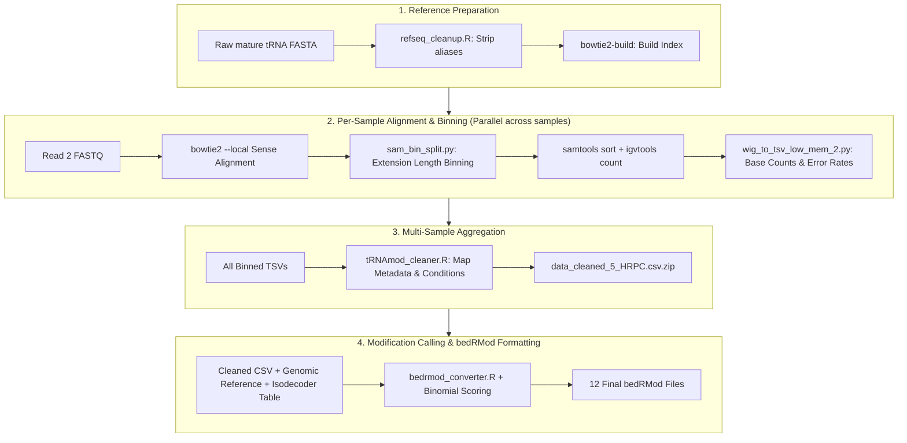

# Multiplex Small RNA Sequencing (MSR-seq) Data Processing Tutorial

Welcome to the Human RNome Project! This tutorial is designed as a friendly, step-by-step guide for anyone—from an undergraduate student with no prior bioinformatics experience to a Principal Investigator—to process Short-Read Sequencing (SRS) MSR-seq data.

In this tutorial, we will cover what MSR-seq is, how the chemistry and biology work, how to set up the software environment, obtain the Docker container, download the data, and run the automated WDL workflow locally, on cloud instances (e.g., Google Cloud Platform / GCP), or on high-performance computing (HPC) clusters like NERSC Perlmutter.

---

## What is MSR-seq and Why Do We Need It?

Transfer RNAs (tRNAs) are essential molecular adaptors that translate mRNA codons into proteins. They are also the most densely chemically modified molecules in human cells, carrying dozens of distinct chemical marks (such as methylations, pseudouridines, and acetylations) that are vital for tRNA stability and accurate translation.

However, sequencing tRNAs is notoriously challenging:
1. **Tight Secondary Structure**: tRNAs fold into tight "cloverleaf" and L-shaped tertiary structures that block standard enzymes.
2. **Bulky Chemical Modifications**: Modifications at the Watson-Crick base-pairing face block reverse transcriptase (RT), causing premature termination or introducing characteristic mutation/deletion errors.

**MSR-seq (Multiplex Small RNA Sequencing)** solves these challenges:
- It uses a specialized capture hairpin oligonucleotide containing an RT primer ligated to the 3' CCA end of mature tRNAs.
- It employs **SuperScript IV (SSIV)** reverse transcriptase under optimized conditions to read through modified bases.
- It combines untreated control samples with specific chemical treatments:
  - **Untreated Control (`HRPC_ctrl`)**: Captures intrinsic RT termination and misincorporation signatures caused by bulky modifications (such as $m^1A$, $m^1G$, $m^2_2G$, $m^3C$, $m^2G$, $s^2U$, Inosine, and $acp^3U$).
  - **Bisulfite Treatment (`HRPC_BS`)**: Converts pseudouridine ($\Psi$), 7-methylguanosine ($m^7G$), and 2'-O-methylguanosine ($Gm$) into chemical adducts that form abasic sites, producing diagnostic **deletion signatures** during reverse transcription.
  - **Cyanoborohydride Treatment (`HRPC_CBH`)**: Selectively reduces $N^4$-acetylcytidine ($ac^4C$) and 5-formylcytidine ($f^5C$) under acidic conditions, producing diagnostic **mutation signatures** during reverse transcription.
- Reads are sequenced on Illumina platforms (e.g., NovaSeq X). Read 2 carries the reverse complement of the tRNA sequence.

```
       5' tRNA Terminus                                    3' CCA Tail
              |                                                 |
tRNA:         [=================================================CCA]
                                                                  ||| (Ligated Hairpin Adapter)
RT cDNA:      <---------------------------------------------------' (Primed by SSIV RT)
                 ^ Full-length extension reaches >= 60 nt (Bin 60_200)
```

---

## Installing Software to Run WDL Workflows

If you do not have a NERSC account and are running locally or on a cloud virtual machine (e.g., Google Cloud Platform / GCP, AWS, Azure), you will execute the pipeline using **miniwdl**.

To run the workflow, you only need two pieces of software installed on your system:

### 1. Docker
Docker runs the containerized bioinformatics pipeline.
- Follow the official installation instructions for your operating system: [Install Docker Engine](https://docs.docker.com/engine/install/)
- On Linux, ensure your user can run Docker commands without `sudo` by adding yourself to the `docker` group:
  ```bash
  sudo usermod -aG docker $USER
  ```
  (Log out and log back in for this to take effect.)

### 2. miniwdl
`miniwdl` is a fast, lightweight Python-based runner for Workflow Description Language (WDL) pipelines.
- Install `miniwdl` via `pip`:
  ```bash
  pip install miniwdl
  ```
- Verify the installation:
  ```bash
  miniwdl --version
  ```
- For additional setup options or conda installation, see the [miniwdl getting started guide](https://miniwdl.readthedocs.io/en/latest/getting_started.html#install-miniwdl).

---

## Step 1: Getting the Code (Cloning the Repository)

Download the complete project codebase to your machine. This repository contains the automated pipelines, container configurations, and reference tables required to process the data.

Open your terminal (Terminal on Mac/Linux, or PowerShell/WSL on Windows) and run:

```bash
git clone https://github.com/Human-RNome-Project/HRP-benchmarking-project.git
```

**Understanding the command:**
- `git clone` copies the remote repository from GitHub directly onto your computer into a new directory called `HRP-benchmarking-project`.

---

## Step 2: Navigating to the MSR-seq Pipeline

Move your terminal into the folder where the MSR-seq pipeline lives:

```bash
cd HRP-benchmarking-project
cd pipelines/SRS_workflows/msrseq_wdl
```

Let's look at what is inside this directory:
- `msrseq_pipeline.wdl`: The master workflow blueprint written in WDL.
- `docker/`: Contains the `Dockerfile` recipe and all standalone scripts.
- `ref/`: Subdirectory containing the three required human tRNA reference files.
- `inputs_msrseq_local.json` (and `inputs_msrseq_gcp.json`): Ready-to-run configuration templates configured with local relative paths.
- `inputs_msrseq_perlmutter.json`: Template configured with NERSC Perlmutter CFS paths.
- `README.md`: Quick reference guide for the pipeline.

---

## Step 3: Downloading the Raw Sequencing Data & Directory Layout

Before identifying modifications, we need the raw sequencing reads (stored as compressed FASTQ files ending in `_R2.fastq.gz` or `_2.txt.gz`).

### 3.1 Create the Raw Data Directory
Inside `msrseq_wdl/`, create a dedicated directory called `raw_msrseq/`:

```bash
mkdir -p raw_msrseq
```

### 3.2 Download the FASTQ Files
1. Open your web browser and navigate to the project's data portal:  
   [https://doi.org/10.25585/DOE-HRP/3377574](https://doi.org/10.25585/DOE-HRP/3377574)
2. Follow the portal instructions to navigate to the **SRS (Short-Read Sequencing) MSR-seq** dataset under experiment ID **`HRP_B_012`**.
3. Save the 9 demultiplexed **Read 2** FASTQ files into the `raw_msrseq/` directory using their standard HRP accession filenames:

| File Name | Condition / Treatment | Replicate | Barcode | Target Modifications |
|---|---|:---:|:---:|---|
| `raw_msrseq/HRP_B_012_1_R2.fastq.gz` | `HRPC_CBH` | 1 | `bc8` | $ac^4C, f^5C$ (mutation signature) |
| `raw_msrseq/HRP_B_012_2_R2.fastq.gz` | `HRPC_CBH` | 2 | `bc9` | $ac^4C, f^5C$ (mutation signature) |
| `raw_msrseq/HRP_B_012_3_R2.fastq.gz` | `HRPC_CBH` | 3 | `bc10` | $ac^4C, f^5C$ (mutation signature) |
| `raw_msrseq/HRP_B_012_4_R2.fastq.gz` | `HRPC_BS` | 1 | `bc8` | $\Psi, m^7G, Gm$ (deletion signature) |
| `raw_msrseq/HRP_B_012_5_R2.fastq.gz` | `HRPC_ctrl` | 1 | `bc8` | Untreated baseline ($m^1A, m^1G, m^2_2G, \dots$) |
| `raw_msrseq/HRP_B_012_6_R2.fastq.gz` | `HRPC_BS` | 2 | `bc9` | $\Psi, m^7G, Gm$ (deletion signature) |
| `raw_msrseq/HRP_B_012_7_R2.fastq.gz` | `HRPC_ctrl` | 2 | `bc9` | Untreated baseline ($m^1A, m^1G, m^2_2G, \dots$) |
| `raw_msrseq/HRP_B_012_8_R2.fastq.gz` | `HRPC_BS` | 3 | `bc10` | $\Psi, m^7G, Gm$ (deletion signature) |
| `raw_msrseq/HRP_B_012_9_R2.fastq.gz` | `HRPC_ctrl` | 3 | `bc10` | Untreated baseline ($m^1A, m^1G, m^2_2G, \dots$) |

> [!TIP]
> By downloading the FASTQ files directly into `raw_msrseq/` with these filenames, you do **not need to edit any paths** in `inputs_msrseq_local.json` or `inputs_msrseq_gcp.json`!

---

## Step 4: Building the Docker Container Locally

Bioinformatics pipelines require many specialized software tools (Bowtie2, Samtools, IGVTools, Java 17, Python with pysam/numpy/pandas, R with tidyverse/openxlsx/Biostrings). Installing them manually can be complex and error-prone.

To ensure immediate reproducibility without external download dependencies, build the Docker container image locally from the provided `docker/` directory:

```bash
docker build -t msrseq-pipeline:v1 docker/
```

**Understanding the command:**
- `docker build`: Compiles all bioinformatics tools, Python scripts, and R packages according to `docker/Dockerfile`.
- `-t msrseq-pipeline:v1`: Tags the resulting container image as `msrseq-pipeline:v1`, which matches the image name specified in the input JSON files.

> [!NOTE]
> Building the Docker image locally is the simplest and recommended method. Once built, `miniwdl` will automatically use this local image. If you later wish to run on a remote cloud cluster that pulls images from a registry, you can optionally push it to Docker Hub (`docker tag msrseq-pipeline:v1 <your_username>/msrseq-pipeline:v1 && docker push <your_username>/msrseq-pipeline:v1`).

---

## Step 5: Reference Files and the Input JSON

### 5.1 Reference Files in `ref/`
The three required reference files are already bundled in the repository inside the `ref/` subdirectory:
1. **`ref/Step1_260_seq_hg38-mature-tRNAs.fa`**: High-confidence mature tRNA sequences (260 distinct sequences with 3' CCA tails).
2. **`ref/hg38_chromosomal_tRNA_genes_high_confidence_intro_remove+CCA_upper_case2.fa`**: Genomic tRNA gene reference sequences used to map relative tRNA coordinates to chromosomes.
3. **`ref/Table S3_cyto all isodecoders3.xlsx`**: Annotation spreadsheet mapping each tRNA isodecoder to its cytosolic/mitochondrial identity, anticodon, and known modifications.

Because these files are already in `ref/`, you do not need to download or search for them.

### 5.2 The Input JSON (`inputs_msrseq_local.json` / `inputs_msrseq_gcp.json`)

The template file `inputs_msrseq_local.json` (and `inputs_msrseq_gcp.json`) uses relative directory paths. Because the reference files are in `ref/` and your FASTQ files are in `raw_msrseq/`, this file works directly out-of-the-box:

```json
{
  "msrseq_pipeline.mature_trna_fasta": "ref/Step1_260_seq_hg38-mature-tRNAs.fa",
  "msrseq_pipeline.chromosomal_trna_fasta": "ref/hg38_chromosomal_tRNA_genes_high_confidence_intro_remove+CCA_upper_case2.fa",
  "msrseq_pipeline.isodecoder_table": "ref/Table S3_cyto all isodecoders3.xlsx",
  "msrseq_pipeline.docker_image": "msrseq-pipeline:v1",
  "msrseq_pipeline.ref_cpus": 8,
  "msrseq_pipeline.sample_cpus": 8,
  "msrseq_pipeline.agg_cpus": 4,
  "msrseq_pipeline.convert_cpus": 4,
  "msrseq_pipeline.samples": [
    {
      "sample_id": "HRP_B_012_tRNA_005",
      "treatment": "HRPC_ctrl",
      "replicate": 1,
      "barcode": "bc8",
      "fastq_read2": "raw_msrseq/HRP_B_012_5_R2.fastq.gz"
    },
    {
      "sample_id": "HRP_B_012_tRNA_007",
      "treatment": "HRPC_ctrl",
      "replicate": 2,
      "barcode": "bc9",
      "fastq_read2": "raw_msrseq/HRP_B_012_7_R2.fastq.gz"
    },
    {
      "sample_id": "HRP_B_012_tRNA_009",
      "treatment": "HRPC_ctrl",
      "replicate": 3,
      "barcode": "bc10",
      "fastq_read2": "raw_msrseq/HRP_B_012_9_R2.fastq.gz"
    },
    {
      "sample_id": "HRP_B_012_tRNA_004",
      "treatment": "HRPC_BS",
      "replicate": 1,
      "barcode": "bc8",
      "fastq_read2": "raw_msrseq/HRP_B_012_4_R2.fastq.gz"
    },
    {
      "sample_id": "HRP_B_012_tRNA_006",
      "treatment": "HRPC_BS",
      "replicate": 2,
      "barcode": "bc9",
      "fastq_read2": "raw_msrseq/HRP_B_012_6_R2.fastq.gz"
    },
    {
      "sample_id": "HRP_B_012_tRNA_008",
      "treatment": "HRPC_BS",
      "replicate": 3,
      "barcode": "bc10",
      "fastq_read2": "raw_msrseq/HRP_B_012_8_R2.fastq.gz"
    },
    {
      "sample_id": "HRP_B_012_tRNA_001",
      "treatment": "HRPC_CBH",
      "replicate": 1,
      "barcode": "bc8",
      "fastq_read2": "raw_msrseq/HRP_B_012_1_R2.fastq.gz"
    },
    {
      "sample_id": "HRP_B_012_tRNA_003",
      "treatment": "HRPC_CBH",
      "replicate": 2,
      "barcode": "bc9",
      "fastq_read2": "raw_msrseq/HRP_B_012_3_R2.fastq.gz"
    },
    {
      "sample_id": "HRP_B_012_tRNA_002",
      "treatment": "HRPC_CBH",
      "replicate": 3,
      "barcode": "bc10",
      "fastq_read2": "raw_msrseq/HRP_B_012_2_R2.fastq.gz"
    }
  ]
}
```

---

## Step 6: Running the End-to-End Pipeline

Now you are ready to launch the pipeline!

### What Happens Behind the Scenes?


```mermaid
flowchart TD
    subgraph StepA ["1. Reference Preparation"]
        R1[Raw mature tRNA FASTA] --> R2[refseq_cleanup.R: Strip aliases]
        R2 --> R3[bowtie2-build: Build Index]
    end

    subgraph StepB ["2. Per-Sample Alignment & Binning (Parallel across samples)"]
        S1[Read 2 FASTQ] --> S2[bowtie2 --local Sense Alignment]
        S2 --> S3[sam_bin_split.py: Extension Length Binning]
        S3 --> S4[samtools sort + igvtools count]
        S4 --> S5[wig_to_tsv_low_mem_2.py: Base Counts & Error Rates]
    end

    subgraph StepC ["3. Multi-Sample Aggregation"]
        A1[All Binned TSVs] --> A2[tRNAmod_cleaner.R: Map Metadata & Conditions]
        A2 --> A3[data_cleaned_5_HRPC.csv.zip]
    end

    subgraph StepD ["4. Modification Calling & bedRMod Formatting"]
        B1[Cleaned CSV + Genomic Reference + Isodecoder Table] --> B2[bedrmod_converter.R + Binomial Scoring]
        B2 --> B3[12 Final bedRMod Files]
    end

    StepA --> StepB
    StepB --> StepC
    StepC --> StepD
```

### Execution with miniwdl (Recommended for Local Workstations & Cloud VMs)

Run the workflow using `miniwdl`:

```bash
miniwdl run msrseq_pipeline.wdl \
  -i inputs_msrseq_local.json \
  --dir run_output \
  --verbose
```

*(You can also specify `-i inputs_msrseq_gcp.json`, which points to the same local relative paths.)*

**Understanding the command:**
- `miniwdl run`: Starts the workflow execution engine.
- `msrseq_pipeline.wdl`: Master workflow definition.
- `-i inputs_msrseq_local.json`: Configuration specifying inputs and local directories.
- `--dir run_output`: Directory where all intermediate and final outputs will be written.
- `--verbose`: Displays real-time progress for each pipeline task.

### Execution on HPC (NERSC Perlmutter with JAWS)
For users running on the NERSC supercomputer:

```bash
jaws submit \
  --no-cache \
  msrseq_pipeline.wdl \
  inputs_msrseq_perlmutter.json \
  perlmutter \
  --tag "msrseq_tRNA_run"
```

---

## Step 7: Inspecting the Final Outputs (`bedRMod` Files)

Once the workflow finishes, your outputs will be organized inside `run_output/`.

### 7.1 What is a `bedRMod` File?
A **`bedRMod`** (BED RNA Modification) file is a standardized genomic file format developed by the RNA modification community to represent post-transcriptional RNA modifications.

Each line represents a specific modified nucleotide position with the following columns:
1. `chrom`: Chromosome name (e.g., `chr1`, `chr6`).
2. `chromStart`: 0-based starting genomic position.
3. `chromEnd`: 0-based ending genomic position.
4. `name`: Name or symbol of the RNA modification (e.g., `m1A`, `m2,2G`, `ac4C`, `Psi`).
5. `score`: Statistical confidence score (scaled integer from 0 to 1000).
6. `strand`: Strand orientation (`+` or `-`).
7. `thickStart`: Display start coordinate.
8. `thickEnd`: Display end coordinate.
9. `itemRgb`: Color code for genome browser visualization.
10. `coverage`: Total read depth (pileup) at this nucleotide position.
11. `frequency`: Estimated modification stoichiometry (percentage from 0% to 100%).

### 7.2 The 12 Output Files
The pipeline produces exactly 12 `bedRMod` files representing all combinations of chemical treatments and biological replicates:

| Output File Name | Chemical Condition | Detection Signature | Replicate | Target Modifications |
| :--- | :--- | :--- | :---: | :--- |
| `HRPC_ctrl_mut_1.bedRMod`<br>`HRPC_ctrl_mut_2.bedRMod`<br>`HRPC_ctrl_mut_3.bedRMod` | Control (Untreated) | RT Mutation Rate | 1<br>2<br>3 | $m^1A$, $m^1G$, $m^2_2G$, $m^3C$, $m^2G$, $s^2U$, Inosine, $m^1I$, $acp^3U$ |
| `HRPC_ctrl_del_1.bedRMod`<br>`HRPC_ctrl_del_2.bedRMod`<br>`HRPC_ctrl_del_3.bedRMod` | Control (Untreated) | RT Deletion Rate | 1<br>2<br>3 | Baseline control deletions (background noise filter) |
| `HRPC_BS_1.bedRMod`<br>`HRPC_BS_2.bedRMod`<br>`HRPC_BS_3.bedRMod` | Bisulfite Treated | RT Deletion Rate | 1<br>2<br>3 | Pseudouridine ($\Psi$), $m^7G$, 2'-O-methyl ($Gm$) |
| `HRPC_CBH_1.bedRMod`<br>`HRPC_CBH_2.bedRMod`<br>`HRPC_CBH_3.bedRMod` | Cyanoborohydride Treated | RT Mutation Rate | 1<br>2<br>3 | $ac^4C$ (acetylcytidine), $f^5C$ (formylcytidine) |

### 7.3 Viewing Your Results
To inspect the top rows of one of your output files:

```bash
head -n 10 run_output/out/bedrmod_files/00/HRPC_BS_1.bedRMod
```

You can open these files in Excel, R, Python, or load them directly into the **UCSC Genome Browser** or **IGV** to inspect modification peaks along human tRNA genes!

---

## Summary & Next Steps

**Congratulations!** You have completed the full end-to-end MSR-seq data processing pipeline:
1. Installed `miniwdl` and `Docker`.
2. Built the reproducible `msrseq-pipeline:v1` Docker container locally.
3. Downloaded the FASTQ files to `raw_msrseq/` and verified reference files in `ref/`.
4. Executed the automated WDL workflow with `miniwdl run`.
5. Generated standardized `bedRMod` files ready for biological analysis and benchmark comparisons.
