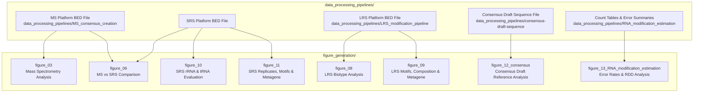

# Human RNome Project — Figure Generation & Navigation Guide

This directory contains the figure generation scripts, plotting utilities, and reference datasets used to create the benchmark figures for the **Human RNome Project (HRP)** manuscript.

---

## Workflow Architecture & Navigation Map

All figure generation scripts process precomputed BED files, error rate summary tables, or consensus modification lists generated by the upstream data processing pipelines located in `../data_processing_pipelines/`.

---

## Directory Navigation Guide

Below is a detailed guide to each directory in `figure_generation/`, summarizing what users can expect to find, key scripts, and required upstream data inputs.

### 1. [`figure_03/`](figure_03/) — Mass Spectrometry (MS) Analysis
- **What users will find:** Python scripts for plotting mass spectrometry modification detection, stoichiometry distributions, and biotype coverage.
- **Key Scripts:**
  - `figure3a-f.py`: Plots Panels A–F (MS modification stoichiometry, biotype distributions, detection thresholds).
  - `figure_3g.py`: Plots Panel G (comparative stoichiometry distributions).
  - `general_plot.py`, `single_group_plot.py`, `translation_dicts.py`: Shared plotting and helper modules.
- **Upstream Data Dependency:** Harmonized MassSpec BED files generated by [`../data_processing_pipelines/MS_consensus_creation/`](../data_processing_pipelines/MS_consensus_creation/).

---

### 2. [`figure_06/`](figure_06/) — Mass Spectrometry vs Short-Read Sequencing Comparison
- **What users will find:** Comparative plotting scripts evaluating agreement and discrepancies between Mass Spectrometry (MS) and Short-Read Sequencing (Illumina / SRS) modification calls across rRNA and tRNA biotypes.
- **Key Scripts & Assets:**
  - `figure_6a.py`, `figure_6b.py`, `figure_6c.py`: Plotting scripts for Panels A, B, and C.
  - `figure_6_helper_functions.py`: Data loading and coordinate mapping utilities.
  - `H.sapiens_rRNA_reference.bed`, `tRNA_sprinzl.xlsx`: rRNA reference BED and tRNA Sprinzl coordinate definitions.
  - `README.md` & `environment.yml`: Folder setup and execution instructions.
- **Upstream Data Dependency:** MS consensus BEDs (`MS_consensus_creation/`) and SRS platform BED files.

---

### 3. [`figure_08/`](figure_08/) — Long-Read Sequencing (LRS) Biotype Analysis
- **What users will find:** Comprehensive performance analysis of Oxford Nanopore Direct RNA Sequencing (LRS) modification detection across polyA RNA, rRNA, and tRNA biotypes.
- **Key Scripts & Assets:**
  - `biotype_analysis.py`: Main analysis script computing sensitivity, modification level breakdowns, and coverage metrics across biotypes.
  - `README_biotype_analysis.md`: Documentation covering input flags and run configurations.
- **Upstream Data Dependency:** LRS platform BED files generated by [`../data_processing_pipelines/LRS_modification_pipeline/`](../data_processing_pipelines/LRS_modification_pipeline/).

---

### 4. [`figure_09/`](figure_09/) — LRS Modification Composition, Motifs & Metagene Distribution
- **What users will find:** Scripts analyzing LRS modification type composition, sequence motif context (e.g., DRACH motif for m6A), and transcript metagene distributions.
- **Key Scripts & Assets:**
  - `modification_type_composition.py`: Plots Figure 9A (modification type breakdowns across biotypes).
  - `Motif_Fig_9B.py`: Extracts sequence motif contexts and generates sequence logos.
  - `MetagenePlot_Fig9_C.R`: R script generating metagene density profiles across 5' UTR, CDS, and 3' UTR transcript regions.
  - `README_modification_type_composition.md`: Usage guide and input data formats.
- **Upstream Data Dependency:** LRS platform BED files (`LRS_modification_pipeline/`).

---

### 5. [`figure_10/`](figure_10/) — Short-Read Sequencing (SRS) rRNA & tRNA Evaluation
- **What users will find:** Evaluation and heatmap visualizers for Short-Read Sequencing (Illumina) modification detection algorithms across rRNA subunits (18S, 28S, 5.8S) and tRNA molecules.
- **Key Scripts & Assets:**
  - `figure10b.py`, `figure10c.py`: Main panel plotting scripts for Figure 10.
  - `plot_18.py`, `plot28.py`, `plot_5_8.py`: Subunit-specific rRNA modification plotting scripts.
  - `H.sapiens_rRNA_reference.bed`, `tRNA_sprinzl.xlsx`: Target coordinate annotations.
  - `README.md` & `environment.yml`: Folder instructions and environment dependencies.
- **Upstream Data Dependency:** SRS platform BED files.

---

### 6. [`figure_11/`](figure_11/) — SRS Replicates, Methods, Motifs & Integrated Metagene
- **What users will find:** An R-based analysis suite evaluating short-read sequencing data across biological replicates, detection methods, gene annotations, sequence motifs, and transcript metagene profiles.
- **Key Scripts & Assets:**
  - `0.0_anno_to_gene.R`: Maps modification coordinates to gene models.
  - `1.0_compare_replicates.R`: Evaluates replicate reproducibility and consistency.
  - `2.0_compare_methods.R`: Benchmarks performance across SRS detection algorithms.
  - `3.0_integrated_metagene.R`, `3.1_integrated_top_Gene.R`, `3.2_integrated_motif.R`: Generates metagene profiles, top modified gene analyses, and motif enrichment plots.
  - `Readme.md`: Step-by-step pipeline execution order.
- **Upstream Data Dependency:** SRS platform BED files.

---

### 7. [`figure_12_consensus/`](figure_12_consensus/) — Human RNome Consensus Draft Reference Analysis
- **What users will find:** The complete panel plotting suite for Figure 12, analyzing the benchmark consensus draft reference across polyA, rRNA, and tRNA biotypes.
- **Key Scripts & Assets:**
  - `plot_panel_a_polyA_manhattan_density.py`: Manhattan-like 1 Mb bin modification density plot.
  - `plot_panel_b_chr1_160M_region_zoom.py`: Locus zoom plot (chr1:160.45–160.85 Mb) showing m6A and Y sites.
  - `plot_panel_c_polyA_per_mb_vs_genes.py`: Scatter plot comparing polyA modification density vs. gene density per Mb.
  - `plot_panel_d_polyA_sites_per_gene_histogram.py`: Histogram of polyA modification sites per gene.
  - `plot_panel_e_observed_vs_expected_mod_load.py`: GLM regression of observed vs. expected modification load.
  - `plot_panel_f_composite_metagene.py`: Metagene density profile across mRNA regions.
  - `plot_panel_g_rRNA_region_PTC.py`: Regional modification map along human rRNA sequences.
  - `plot_panel_h_tiered_rRNA_only_9o3v.py`: 3D ribosome structure visualization of rRNA modifications in PyMOL (PDB 9O3V).
  - `figure12i.py`: tRNA consensus modification heatmap mapped to Sprinzl coordinates.
  - `README.md`: Detailed panel guide linking from upstream consensus generation (`consensus-draft-sequence/`).
- **Upstream Data Dependency:** Output tiered lists (`tiered_polyA.tsv`, `tiered_rRNA_only.tsv`, `tiered_tRNA.bed`) and `consensus_draft_sequence.bed` generated by [`../data_processing_pipelines/consensus-draft-sequence/`](../data_processing_pipelines/consensus-draft-sequence/).

---

### 8. [`figure_13_RNA_modification_estimation/`](figure_13_RNA_modification_estimation/) — Error Rate & RNA Modification Estimation
- **What users will find:** Figure plotting scripts evaluating sequencing error rates, substitution spectra, modkit stratified error rates, and RNA-DNA Differences (RDDs).
- **Key Scripts & Assets:**
  - `panel_b_per_read_error.py`: Per-read total error rate comparison (native vs. IVT).
  - `panel_c_coverage_mismatch.py`: Coverage mismatch error rate combined across depth deciles.
  - `panel_d_substitution_error.py`: Substitution error rate breakdown across samples.
  - `panel_e_per_site_error.py`: Per-site error rate stratified by modification type.
  - `panel_f_substitution_spectrum.py`: 12-way nucleotide substitution spectrum.
  - `panel_g_rdd_sites.py`: Candidate RDD sites vs. frequency threshold.
  - `README.md`: Detailed guide linking to upstream count table generation (`pysamstats`) and DOE Data Explorer precalculated downloads.
- **Upstream Data Dependency:** Precalculated count tables and summary TSVs/JSONs generated by [`../data_processing_pipelines/RNA_modification_estimation/`](../data_processing_pipelines/RNA_modification_estimation/).

---

## Quick Navigation Summary Table

| Directory | Primary Platform Scope | Key Target Biotypes | Upstream Pipeline Source |
|---|---|---|---|
| [`figure_03/`](figure_03/) | Mass Spectrometry (MS) | rRNA, tRNA, polyA | `data_processing_pipelines/MS_consensus_creation/` |
| [`figure_06/`](figure_06/) | MS vs. SRS (Illumina) | rRNA, tRNA | `MS_consensus_creation/` & SRS platform BEDs |
| [`figure_08/`](figure_08/) | LRS (Nanopore DRS) | polyA, rRNA, tRNA | `data_processing_pipelines/LRS_modification_pipeline/` |
| [`figure_09/`](figure_09/) | LRS (Nanopore DRS) | polyA, rRNA, tRNA | `data_processing_pipelines/LRS_modification_pipeline/` |
| [`figure_10/`](figure_10/) | SRS (Illumina) | rRNA, tRNA | SRS platform BEDs |
| [`figure_11/`](figure_11/) | SRS (Illumina) | mRNA / polyA | SRS platform BEDs |
| [`figure_12_consensus/`](figure_12_consensus/) | Multi-platform Consensus | polyA, rRNA, tRNA | `data_processing_pipelines/consensus-draft-sequence/` |
| [`figure_13_RNA_modification_estimation/`](figure_13_RNA_modification_estimation/) | LRS Pileups & RDD | polyA, rRNA, tRNA | `data_processing_pipelines/RNA_modification_estimation/` |
