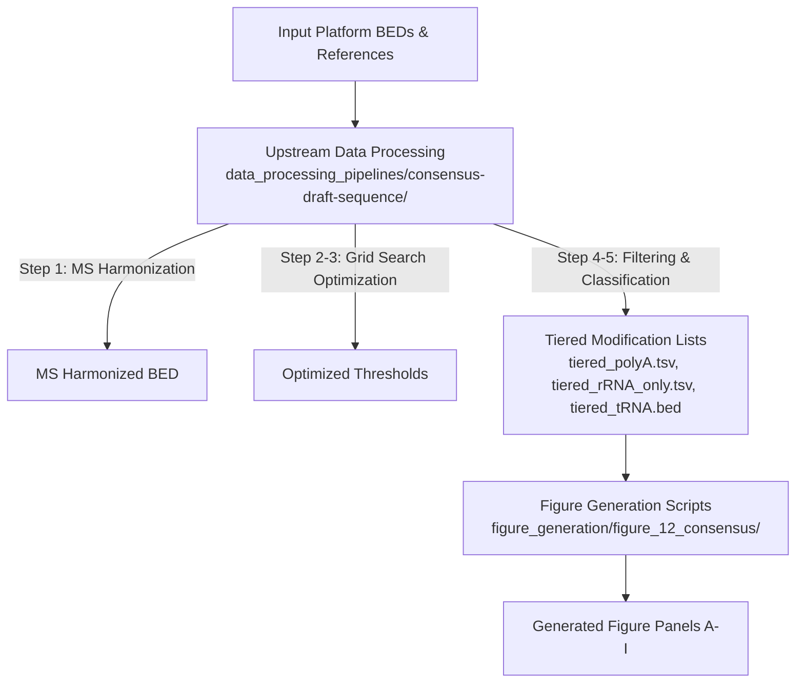

# Figure 12: Human RNome Consensus Draft Reference Analysis & Panel Plotting

This directory contains the figure generation scripts used to create the panels for **Figure 12** of the Human RNome Project benchmark. These scripts analyze and plot figures derived from the consensus draft reference sequences across polyA RNA, rRNA, and tRNA biotypes.

---

## Workflow Overview

Figure generation is the final stage of the consensus draft reference workflow. Users should complete the upstream data processing steps before running the figure plotting scripts in this folder.



---

## Step 1: Upstream Data Processing

Before running the figure generation scripts, you must generate the required input tiered lists and consensus BED files. Detailed instructions and automated orchestration scripts are provided in the parent data processing directory:

👉 **Upstream Pipeline Documentation:** [`../../data_processing_pipelines/consensus-draft-sequence/README.md`](../../data_processing_pipelines/consensus-draft-sequence/README.md)

### Summary of Upstream Processing Steps

1. **Mass Spectrometry Harmonization:** Resolves ambiguous MassSpec modification calls by cross-referencing with curated reference BEDs and high-confidence sequencing datasets (`scripts/harmonize_massspec.py`).
2. **Parameter Range Generation:** Computes quantile-based parameter grids over score, coverage, and modification level (`scripts/generate_parameter_ranges.py` and `scripts/generate_tRNA_parameter_ranges.py`).
3. **Grid Search Optimization:** Executes multi-way grid searches across platform pairs (Illumina, ONT, MassSpec) to maximize Jaccard similarity (`scripts/run_rrna_grid_from_ranges.py`, `scripts/run_3way_*.py`, `scripts/run_polya_grid_fast.py`, `scripts/run_trna_grid_from_ranges.py`).
4. **Filtering & Classification:** Filters multi-platform modification calls based on optimal thresholds (`scripts/run_filtering.py` and `scripts/run_tRNA_filtering.py`).
5. **Tiered List & Consensus Creation:** Generates tiered confidence lists (`tiered_polyA.tsv`, `tiered_rRNA_only.tsv`, `tiered_tRNA.bed`) and the unified consensus draft sequence BED (`consensus_draft_sequence.bed`).

> [!TIP]
> You can run the entire upstream pipeline automatically using `run_pipeline.sh` inside the [`../../data_processing_pipelines/consensus-draft-sequence/`](../../data_processing_pipelines/consensus-draft-sequence/) folder.

---

## Step 2: Environment Setup

Ensure you have activated the required Python environment containing plotting dependencies (`pandas`, `numpy`, `matplotlib`, `scipy`, `pymol`, `openpyxl`).

Using Conda (from repository root or data processing folder):
```bash
conda env create -f ../../data_processing_pipelines/consensus-draft-sequence/environment.yml
conda activate draft-ref-pipeline
```

Or install via pip:
```bash
pip install -r ../../data_processing_pipelines/consensus-draft-sequence/requirements.txt
```

---

## Step 3: Figure Generation Scripts

Once the upstream tiered files (`outputs/tiered_lists/` and `outputs/tiered_tRNA/`) and reference files are available in `inputs/` or `outputs/`, execute the individual panel plotting scripts in this directory.

| Panel | Script Name | Description | Key Inputs | Outputs |
|---|---|---|---|---|
| **Panel A** | [`plot_panel_a_polyA_manhattan_density.py`](plot_panel_a_polyA_manhattan_density.py) | Manhattan-like density plot of polyA modifications across 1 Mb genomic bins | `outputs/tiered_lists/tiered_polyA.tsv`, `GRCh38.primary_assembly.genome.fa.fai` | `figures/panel_a_polyA_manhattan_density/` |
| **Panel B** | [`plot_panel_b_chr1_160M_region_zoom.py`](plot_panel_b_chr1_160M_region_zoom.py) | Zoomed locus plot for chr1:160.45–160.85 Mb with m6A and Y modification calls | `outputs/tiered_lists/tiered_polyA.tsv`, `gencode.v49.primary_assembly.annotation.gtf.gz` | `figures/panel_b_chr1_160M_region_zoom/` |
| **Panel C** | [`plot_panel_c_polyA_per_mb_vs_genes.py`](plot_panel_c_polyA_per_mb_vs_genes.py) | Scatter plot comparing polyA modification density vs protein-coding gene density per Mb | `outputs/tiered_lists/tiered_polyA.tsv`, `gencode.v49.primary_assembly.annotation.gtf.gz` | `figures/panel_c_polyA_per_mb_vs_genes/` |
| **Panel D** | [`plot_panel_d_polyA_sites_per_gene_histogram.py`](plot_panel_d_polyA_sites_per_gene_histogram.py) | Distribution of polyA modification sites per protein-coding gene | `outputs/tiered_lists/tiered_polyA.tsv`, `gencode.v49.primary_assembly.annotation.gtf.gz` | `figures/panel_d_polyA_sites_per_gene_histogram/` |
| **Panel E** | [`plot_panel_e_observed_vs_expected_mod_load.py`](plot_panel_e_observed_vs_expected_mod_load.py) | Observed vs expected polyA modification load per gene via GLM modeling | `outputs/tiered_lists/tiered_polyA.tsv`, `gencode.v49.primary_assembly.annotation.gtf.gz`, `OUT.gene_tpm.tsv` | `figures/panel_e_observed_vs_expected_mod_load/` |
| **Panel F** | [`plot_panel_f_composite_metagene.py`](plot_panel_f_composite_metagene.py) | Composite metagene density profile of polyA modifications across mRNA regions | `outputs/tiered_lists/tiered_polyA.tsv`, `gencode.v49.primary_assembly.annotation.gtf.gz` | `figures/panel_f_composite_metagene/` |
| **Panel G** | [`plot_panel_g_rRNA_region_PTC.py`](plot_panel_g_rRNA_region_PTC.py) | Regional map of modifications along human rRNA reference sequences | `outputs/tiered_lists/tiered_rRNA_only.tsv`, `hs_rRNAs_NR_046235.fa.fai` | `figures/panel_g_rRNA_region_PTC/` |
| **Panel H** | [`plot_panel_h_tiered_rRNA_only_9o3v.py`](plot_panel_h_tiered_rRNA_only_9o3v.py) | 3D ribosome structure visualization of rRNA modification sites in PyMOL | `outputs/tiered_lists/tiered_rRNA_only.tsv`, `9o3v.cif`, `rcsb_pdb_9O3V.fasta` | `figures/panel_h_tiered_rRNA_only_9o3v/` |
| **Panel I** | [`figure12i.py`](figure12i.py) | Heatmap of tRNA consensus modifications mapped to Sprinzl coordinates | `outputs/tiered_tRNA/tiered_tRNA.bed`, `tRNA_sprinzl.xlsx` | `tRNA_Method_Consensus_heatmap.svg` |

---

## Running Figure Generation

To execute all figure scripts individually from this directory:

```bash
python plot_panel_a_polyA_manhattan_density.py
python plot_panel_b_chr1_160M_region_zoom.py
python plot_panel_c_polyA_per_mb_vs_genes.py
python plot_panel_d_polyA_sites_per_gene_histogram.py
python plot_panel_e_observed_vs_expected_mod_load.py
python plot_panel_f_composite_metagene.py
python plot_panel_g_rRNA_region_PTC.py
python plot_panel_h_tiered_rRNA_only_9o3v.py
python figure12i.py
```

Generated plots will be saved into the respective `figures/` output subdirectories as specified in each script.
