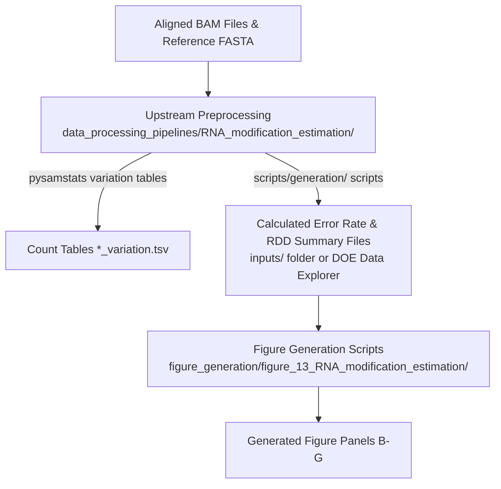

# Figure 13: Error Rate and RNA Modification Estimation Panel Plotting

This directory contains the figure generation plotting scripts for reproducing **Figure 13** (Panels B, C, D, E, F, and G) of the RNA modification estimation section.

---

## Workflow Overview

The figure plotting scripts in this directory rely on precalculated error rate summary tables and pileup statistics generated by the upstream RNA modification estimation pipeline.



---

## Step 1: Upstream Data Processing & Data Download

Before generating the figures, you must obtain or calculate the intermediate summary files (such as per-read error rates, binned coverage mismatch rates, substitution summaries, modkit stratified rates, and genome-wide RDD JSON files).

👉 **Upstream Pipeline Documentation & Instructions:** [`../../data_processing_pipelines/RNA_modification_estimation/README.md`](../../data_processing_pipelines/RNA_modification_estimation/README.md)

### Summary of Upstream Processing Steps

1. **Upstream Count Table Generation (`pysamstats`):**
   Primary alignments are extracted from BAM files using `samtools view -F 2304` and processed using `pysamstats --type variation --fasta <ref> --min-mapq 20 --pad -D 500000 --chromosome <chrom>` to build per-chromosome count tables.
2. **Upstream Metric Calculation:**
   - `scripts/generation/calculate_read_error_rates_parallel.py`: Calculates per-read total error rates (for Panel B).
   - `scripts/generation/calculate_coverage_error_rate.py`: Calculates depth-binned coverage mismatch rates (for Panel C).
   - `scripts/generation/calculate_native_mismatch_rates_memeff_fast.py`: Generates substitution error summaries and modkit stratified rates (for Panels D, E, F).
   - `scripts/generation/rdd_genomewide.py`: Generates genome-wide RDD JSON files (for Panel G).

> [!NOTE]
> Precalculated input files generated from these steps are hosted on the **DOE Data Explorer** ([doi:10.25585/DOE-HRP/3377574](https://doi.org/10.25585/DOE-HRP/3377574)) under `processed_data/RNA_modificaiton_estimation`.
> You can download these preprocessed files directly into the `inputs/` directory as described in the [upstream README](../../data_processing_pipelines/RNA_modification_estimation/README.md#data-download-instructions).

---

## Step 2: Environment Setup

Activate a Python environment with required plotting libraries (`pandas`, `numpy`, `matplotlib`, `scipy`).

Using Conda:
```bash
conda env create -f ../../data_processing_pipelines/RNA_modification_estimation/environment.yml
conda activate hrp_panels
```

Or using Pip:
```bash
pip install -r ../../data_processing_pipelines/RNA_modification_estimation/requirements.txt
```

---

## Step 3: Figure Generation Scripts

Place all required input TSV/JSON files inside the `inputs/` directory (or relative inputs directory as configured), then run the panel plotting scripts:

| Panel | Script Name | Description | Required Inputs | Outputs |
|---|---|---|---|---|
| **Panel B** | [`panel_b_per_read_error.py`](panel_b_per_read_error.py) | Per-read total error rate comparison (native vs. IVT) | `*_per_read_error_rates.tsv` | `figures/panel_b_per_read_error.png` (.pdf) |
| **Panel C** | [`panel_c_coverage_mismatch.py`](panel_c_coverage_mismatch.py) | Coverage mismatch error rate combined across coverage depth deciles | `*_chr*_coverage_binned_error_rates.tsv` | `figures/panel_c_coverage_mismatch.png` (.pdf) |
| **Panel D** | [`panel_d_substitution_error.py`](panel_d_substitution_error.py) | Substitution error rate breakdown across samples | `no_chrY_sub_summary.tsv` | `figures/panel_d_substitution_error.png` (.pdf) |
| **Panel E** | [`panel_e_per_site_error.py`](panel_e_per_site_error.py) | Per-site error rate stratified by RNA modification type | `*_modkit_stratified_rates.tsv` | `figures/panel_e_per_site_error.png` (.pdf) |
| **Panel F** | [`panel_f_substitution_spectrum.py`](panel_f_substitution_spectrum.py) | Full 12-way nucleotide substitution spectrum | `*_substitution_spectrum.tsv` | `figures/panel_f_substitution_spectrum.png` (.pdf) |
| **Panel G** | [`panel_g_rdd_sites.py`](panel_g_rdd_sites.py) | RNA-DNA Difference (RDD) candidate sites vs. frequency threshold | `genomewide_rdd.json` | `figures/panel_g_rdd_sites.png` (.pdf) |

---

## Running Figure Generation

Execute the scripts individually from this directory:

```bash
python panel_b_per_read_error.py
python panel_c_coverage_mismatch.py
python panel_d_substitution_error.py
python panel_e_per_site_error.py
python panel_f_substitution_spectrum.py
python panel_g_rdd_sites.py
```

All generated plots will automatically be written to the `figures/` directory.
